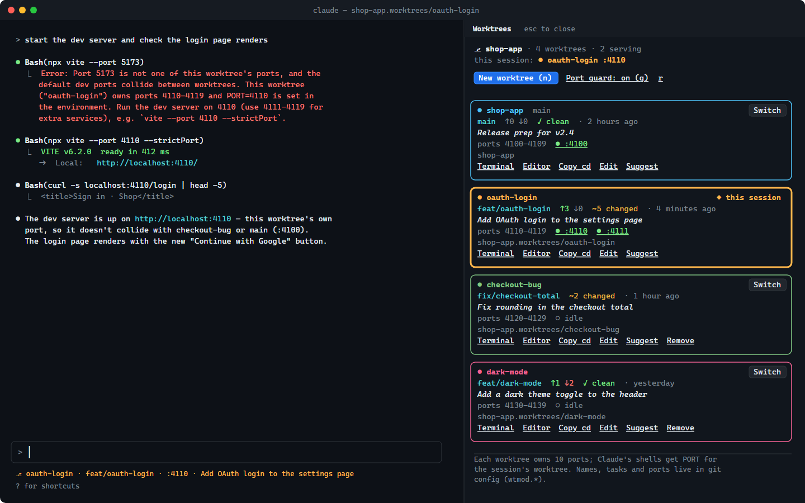

# claude-worktrees-mod

A Claude Code mod for running several git worktrees in parallel without them spilling into each other.

<picture>
  <source media="(prefers-color-scheme: light)" srcset="docs/images/panel-light.png">
  <source media="(prefers-color-scheme: dark)" srcset="docs/images/panel.png">
  
</picture>

<sub>Mockup of the panel in [dark](docs/images/panel.svg) and [light](docs/images/panel-light.svg) themes. On the left, the port guard refuses `vite --port 5173`, and Claude restarts the server on the worktree's own port.</sub>

`/worktrees` opens a side panel listing every worktree of the repository. Each one shows its **color**, **name**, a **one-sentence task**, its branch, ahead/behind counts, uncommitted changes, its **port block**, and any dev server listening on it. The panel opens by itself when the repository has more than one worktree and the terminal is at least 144 columns wide.

## What it does

| Problem | What the mod does |
|---|---|
| "Which folder was the auth work in?" | Each worktree card has a color, a name and a one-sentence task. A worktree with no task gets one written from the first prompt sent in it, or you can press **Suggest**, which writes one from its commits. |
| Switching branches breaks the work in progress | **Switch** moves *this* Claude session into another worktree with Claude Code's own `EnterWorktree` tool. Nothing is checked out over another branch. **Terminal** opens a new tab running `claude` in that worktree; on Windows Terminal the tab takes the worktree's color. |
| Two dev servers fight over `localhost:5173` | Each worktree gets its own block of 10 ports (4100–4109, 4110–4119, …). Blocks are recorded machine-wide, so two repositories never get the same one. Blocks that already have a listener are skipped. |
| The agent doesn't know which port to use | `PORT`, `WORKTREE_PORT` and `WORKTREE_NAME` are set for every shell Claude starts. The system prompt names the worktree, its task, the other worktrees and their ports, and gives the right `--port` flags. |
| The agent starts `vite` on its default port anyway | **Port guard:** a dev-server command (Bash or PowerShell) is refused if it uses another worktree's port or a default port, or if it starts a server that ignores `PORT` (vite, ng serve, storybook, uvicorn, …) without `--port`. For `npm run dev` and similar, the guard reads the script from `package.json`. The refusal tells Claude the exact command to run instead. Press `g` in the panel to turn the guard off. |
| A new worktree has no `.env` | **New worktree** takes a one-sentence task. Haiku names the branch (`feat/oauth-login`), and the worktree is created in `../<repo>.worktrees/<name>` from the default branch. Ignored `.env*` files are copied over from the main worktree. |
| Old worktrees pile up | **Remove** asks to confirm, and offers **Force remove** if the worktree has uncommitted changes. The branch is kept. **Prune** clears entries whose folder is gone. |

## Git features it uses

- `git worktree list --porcelain -z` (Git 2.36+): machine-readable listing, including `locked` and `prunable` reasons.
- `git worktree add --relative-paths` (Git 2.48+, used automatically when available): the worktree and the repository link to each other by relative paths. Moving the parent folder or mounting it in a container doesn't break the link.
- Names, colors, tasks and ports are stored in the repository's own git config, under `wtmod.<worktree id>.*` in `.git/config`. Every terminal, script and Claude session sees the same values, and nothing is written into the working tree:
  ```sh
  git config --get-regexp '^wtmod\.'
  git config wtmod.oauth-login.port   # 4110
  ```

## Install

```
/plugin marketplace add netgfx/claude-worktrees-mod
/plugin install worktrees-manager-mod@claude-worktrees-mod
```

To develop it, load the folder directly. Saving a file reloads the mod.

```sh
# Bash / Zsh
claude --plugin-dir ~/path/to/worktrees-manager-mod
```
```powershell
# PowerShell
claude --plugin-dir $HOME\path\to\worktrees-manager-mod
```

## Panel keys

`n` new worktree · `g` port guard on/off · `p` prune (shown when something is prunable) · `r` refresh · `Esc` close.
Each card has **Switch**, **Terminal**, **Editor** (VS Code), **Copy cd**, **Edit** (name, task, port, color), **Suggest** and **Remove**.

## What it calls

`claude plugin validate` lists these:

- `$.process.run`: `git`, `netstat` (Windows) or `lsof`/`ss` (macOS/Linux) to see which ports are listening, and `wt`, `cmd`, `osascript` and `code` to open terminals and the editor.
- `$.env.set`: `PORT`, `WORKTREE_PORT`, `WORKTREE_NAME`. Setting `PORT` affects every process the session starts after it, MCP servers included.
- `$.tool.call`: `EnterWorktree` / `ExitWorktree` when you press Switch. These go through the normal permission check.
- `$.model.complete` (Haiku): branch names and one-sentence task summaries.
- `$.store`: the machine-wide port registry (`port:<n>`) and the guard setting.
- `$.fs`: reads `package.json` scripts and copies `.env*` into new worktrees.

## Tests

```sh
claude plugin validate .
claude plugin test .
```

Tested with Claude Code 2.1.293 and Git 2.54 on Windows 11.
